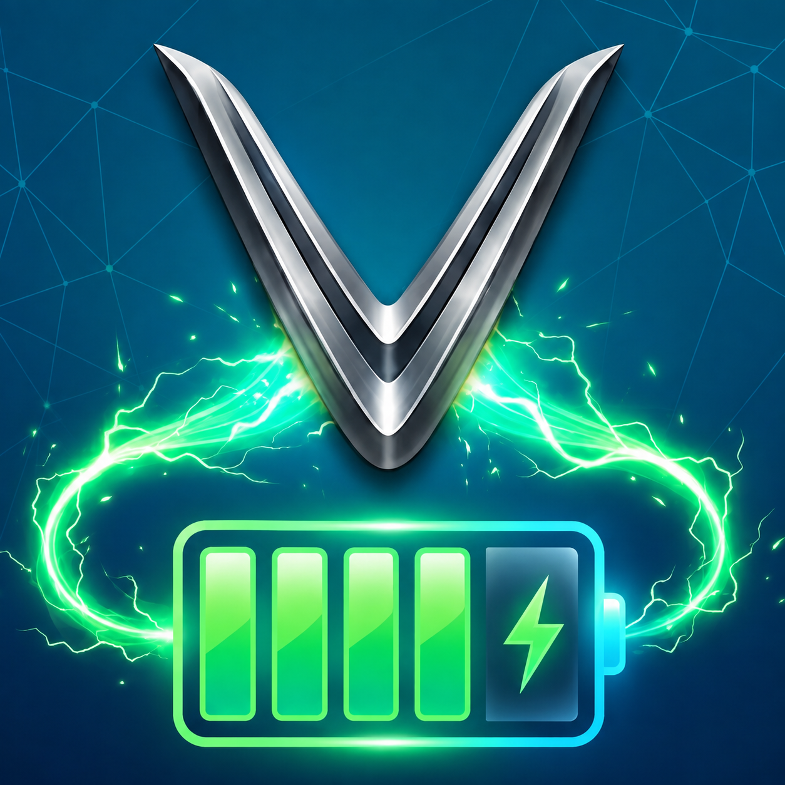
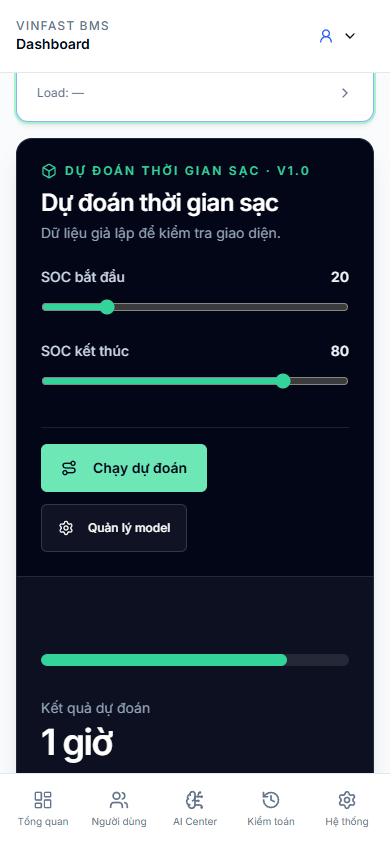
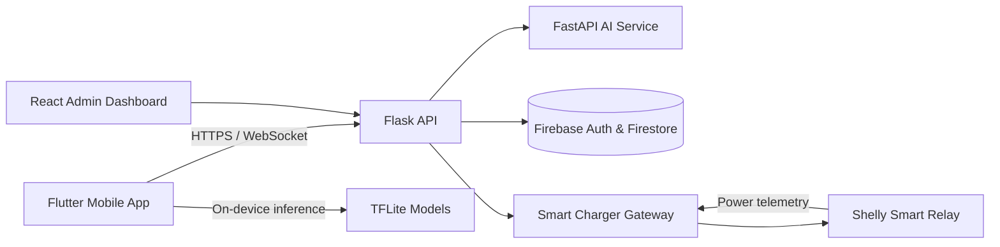

<div align="center">
  

  # VinFast Battery

  **Nền tảng quản lý pin và sạc thông minh dành cho xe máy điện VinFast**

  Theo dõi tình trạng pin, dự đoán thời gian sạc bằng AI và điều khiển bộ sạc IoT trong một hệ sinh thái thống nhất.

  [](https://khanhbes.github.io/projects/vinfast-battery/)
  [](https://flutter.dev/)
  [](https://www.python.org/)
  [](https://firebase.google.com/)
</div>

---

## Tổng quan

**VinFast Battery** là một hệ thống full-stack kết nối ứng dụng Flutter, backend AI, Firebase và IoT gateway để hỗ trợ người dùng xe máy điện quản lý pin chủ động hơn. Sản phẩm tập trung vào ba nhu cầu chính: hiểu rõ trạng thái pin, sạc đúng thời điểm và giảm rủi ro trong quá trình sạc.

Hệ thống được phát triển cho các dòng xe máy điện VinFast như Feliz, Evo, Klara, Vento và Theon, đồng thời có kiến trúc mở để bổ sung cấu hình xe và mô hình dự đoán mới.

<p align="center">
  
</p>

## Điểm nổi bật

### Ứng dụng di động

- Dashboard theo dõi SoC, SoH, quãng đường dự kiến và lịch sử sử dụng.
- Smart Charging cho phép chọn mức pin mục tiêu và tự động kết thúc phiên sạc.
- Quản lý nhiều xe, nhật ký chuyến đi, chi phí năng lượng và lịch bảo trì.
- Hoạt động với chế độ dự phòng khi mất kết nối tới dịch vụ AI.

### AI và phân tích pin

- Dự đoán thời gian sạc, SoC, SoH, quãng đường còn lại và vòng đời pin.
- Phát hiện bất thường từ dữ liệu điện áp, dòng điện, nhiệt độ và công suất.
- Cá nhân hóa mô hình theo lịch sử vận hành của từng xe.
- Hỗ trợ inference phía server và mô hình TFLite trên thiết bị.

### Sạc thông minh và IoT

- Điều khiển relay Shelly qua LAN hoặc Cloud API.
- Thu thập telemetry theo thời gian thực trong suốt phiên sạc.
- Tự ngắt khi đạt mức pin mục tiêu hoặc phát hiện điều kiện không an toàn.
- Khôi phục trạng thái phiên sạc sau gián đoạn kết nối.

### Quản trị hệ thống

- Theo dõi người dùng, phương tiện, cảnh báo và chất lượng dữ liệu.
- Quản lý phiên bản mô hình AI, kiểm thử và quy trình triển khai.
- Dashboard responsive cho máy tính và thiết bị di động.

<p align="center">
  
</p>

## Kiến trúc



| Thành phần | Công nghệ | Vai trò |
| --- | --- | --- |
| Mobile | Flutter, Dart, Riverpod | Trải nghiệm người dùng và inference trên thiết bị |
| API | Python, Flask | Xác thực, đồng bộ dữ liệu và điều phối nghiệp vụ |
| AI service | FastAPI, scikit-learn, XGBoost, TFLite | Dự đoán, hiệu chỉnh và quản lý vòng đời mô hình |
| IoT gateway | FastAPI, Shelly API | Điều khiển relay, telemetry và safety watchdog |
| Admin | React, TypeScript, Vite | Quản trị dữ liệu và mô hình AI |
| Cloud | Firebase Authentication, Firestore | Danh tính, lưu trữ và đồng bộ thời gian thực |

## Cấu trúc repository

```text
Vinfast-Batery/
├── app/                       # Flutter mobile application
├── web/
│   ├── ai_server/             # FastAPI AI service
│   ├── dashboard/             # React administration portal
│   ├── models/                # Model registry and artifacts
│   ├── shelly/                # Smart-charging integration
│   └── server.py              # Unified Flask API
├── smart_charger_gateway/     # Local IoT gateway
├── docs/images/               # README media
├── run.ps1                    # Windows development launcher
└── SMART_CHARGE_SETUP_GUIDE.md
```

## Bắt đầu nhanh

### Yêu cầu

- Flutter SDK 3.32 trở lên và Dart 3.11 trở lên
- Python 3.11 trở lên
- Node.js 18 trở lên
- Docker và Docker Compose nếu chạy toàn bộ backend bằng container
- Một Firebase project cho Authentication và Firestore

### Mobile app

```bash
git clone https://github.com/khanhbes/Vinfast-Batery.git
cd Vinfast-Batery/app
flutter pub get
flutter run
```

Thêm file cấu hình Firebase Android vào `app/android/app/google-services.json` trước khi chạy.

### Backend và dashboard

Trên Windows, có thể dùng launcher ở thư mục gốc:

```powershell
.\run.ps1 1
```

Hoặc khởi động bằng Docker:

```bash
cd web
cp .env.docker.example .env
docker compose up -d --build
```

### IoT gateway

```bash
cd smart_charger_gateway
python -m venv .venv
.venv\Scripts\activate
pip install -r requirements.txt
python main.py
```

Xem [SMART_CHARGE_SETUP_GUIDE.md](SMART_CHARGE_SETUP_GUIDE.md) để cấu hình relay và các lớp bảo vệ phần cứng.

## Kiểm thử

```bash
# Flutter
cd app
flutter test

# Backend
cd ../web
python -m pytest tests -v

# Gateway
cd ../smart_charger_gateway
python -m pytest tests -v

# Admin dashboard
cd ../web/dashboard
npm run lint
npm run build
```

## Bảo mật cấu hình

Không commit service-account JSON, `.env`, khóa ký Android hoặc token Shelly vào repository. Dùng biến môi trường hoặc secret manager khi triển khai và thay khóa ngay nếu thông tin xác thực từng bị công khai.

Các tên tệp Firebase Admin phổ biến đã được loại trừ trong `.gitignore` của dự án.

## Tác giả

Phát triển bởi **KhanhBes**.

- Portfolio: [khanhbes.github.io](https://khanhbes.github.io/)
- GitHub: [github.com/khanhbes](https://github.com/khanhbes)
- LinkedIn: [Phan Khanh](https://www.linkedin.com/in/phan-khanh-b22378290/)

---

<sub>VinFast là nhãn hiệu của chủ sở hữu tương ứng. Dự án này là sản phẩm nghiên cứu/phát triển độc lập và không đại diện cho VinFast.</sub>
