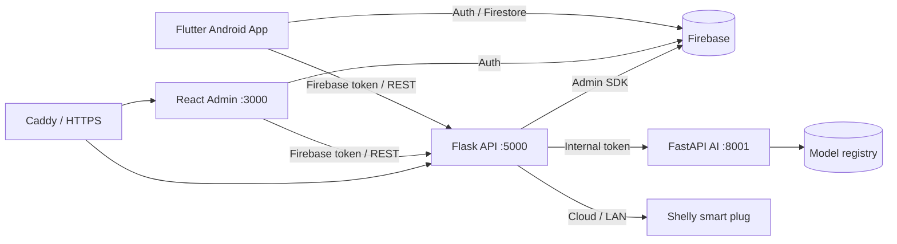

# VinFast Battery

Hệ thống quản lý pin và sạc thông minh dành cho xe máy điện VinFast, gồm ứng dụng Android cho người dùng, cổng quản trị web, API hợp nhất, AI runtime và lớp tích hợp ổ cắm Shelly.

> [!IMPORTANT]
> Đây là dự án phần mềm độc lập, không phải sản phẩm chính thức của VinFast. Các giá trị SOC, SoH, quãng đường còn lại và thời gian sạc do hệ thống ước tính, không thay thế dữ liệu BMS hoặc quy trình an toàn của nhà sản xuất.

Phiên bản ứng dụng hiện tại: **1.1.3+113** · Android tối thiểu: **8.0 / API 26**

## Mục lục

- [Giới thiệu](#giới-thiệu)
- [Tính năng chính](#tính-năng-chính)
- [Kiến trúc hệ thống](#kiến-trúc-hệ-thống)
- [Công nghệ sử dụng](#công-nghệ-sử-dụng)
- [Cấu trúc mã nguồn](#cấu-trúc-mã-nguồn)
- [Yêu cầu môi trường](#yêu-cầu-môi-trường)
- [Cấu hình Firebase](#cấu-hình-firebase)
- [Chạy dự án trên Windows](#chạy-dự-án-trên-windows)
- [Chạy bằng Docker](#chạy-bằng-docker)
- [Chạy ứng dụng Flutter](#chạy-ứng-dụng-flutter)
- [Build APK](#build-apk)
- [API chính](#api-chính)
- [Dữ liệu và phân quyền](#dữ-liệu-và-phân-quyền)
- [Kiểm thử](#kiểm-thử)
- [Bảo mật và an toàn](#bảo-mật-và-an-toàn)
- [Khắc phục sự cố](#khắc-phục-sự-cố)
- [Tài liệu liên quan](#tài-liệu-liên-quan)

## Giới thiệu

VinFast Battery hỗ trợ theo dõi tình trạng pin, quản lý nhiều xe, ghi nhận lịch sử sạc/chuyến đi, nhắc bảo dưỡng và lập kế hoạch sạc. Dữ liệu người dùng được lưu trên Firebase và phân tách bằng `ownerUid`. Backend cung cấp REST API cho ứng dụng, dashboard quản trị và các tác vụ AI.

Hệ thống gồm sáu thành phần:

1. **Mobile App**: ứng dụng Flutter dành cho người sử dụng xe.
2. **Admin Portal**: dashboard React dành cho quản trị viên.
3. **Unified API**: Flask API xử lý xác thực, dữ liệu, đồng bộ, AI và cập nhật APK.
4. **AI Server**: FastAPI runtime quản lý, kiểm thử, triển khai và suy luận mô hình.
5. **Smart Charger Integration**: kết nối Shelly Cloud/LAN để theo dõi và điều khiển relay sạc.
6. **Firebase**: Authentication và Firestore làm lớp định danh, lưu trữ và đồng bộ dữ liệu.

## Tính năng chính

### Ứng dụng Android

- Đăng ký, đăng nhập và duy trì phiên bằng Firebase Authentication.
- Quản lý nhiều xe và chuyển nhanh ngữ cảnh xe đang sử dụng.
- Hiển thị SOC, SoH, dung lượng, quãng đường ước tính và cảnh báo pin.
- Ghi nhận lịch sử sạc, chi phí, hành trình và dữ liệu bảo dưỡng.
- Theo dõi chuyến đi bằng GPS, bản đồ và dự đoán mức tiêu thụ/quãng đường.
- Lập kế hoạch sạc theo SOC hiện tại, SOC mục tiêu, công suất và thời gian dự kiến.
- Kết nối Shelly qua Cloud hoặc LAN, đọc trạng thái relay và điều khiển sạc.
- Lịch sử Smart Charge, phản hồi sau phiên sạc và hồ sơ AI cá nhân theo từng xe.
- Thông báo cục bộ, tác vụ nền, cảnh báo kết nối và nhắc bảo dưỡng.
- Giao diện tiếng Việt/tiếng Anh và các thiết lập hiển thị.
- Đồng bộ model AI đã triển khai và kiểm tra phiên bản ứng dụng từ server.

### Admin Portal

- Dashboard KPI về người dùng, xe, tình trạng pin và cảnh báo.
- Quản lý người dùng và các thực thể dữ liệu hệ thống.
- Tìm kiếm, lọc, soft delete, khôi phục và thao tác hàng loạt.
- Import/export JSON hoặc CSV và audit log truy vết thay đổi.
- AI Center để xem catalog, upload, validate, test, deploy, rollback hoặc vô hiệu hóa model.
- Phòng thử nghiệm model với đầu vào động theo manifest.
- Quản lý cấu hình phát hành APK cho ứng dụng.

### AI và phân tích

Các nhóm model được tổ chức theo registry/manifest và có thể thay nóng:

- Dự đoán SOC và quãng đường còn lại.
- Ước tính thời gian sạc và suy giảm SoH.
- Phân tích hành vi, mẫu sử dụng và phát hiện bất thường.
- Gợi ý sạc, eco driving và eco routing.
- Dự đoán chuyến đi và tiêu thụ năng lượng.

Model có thể sử dụng scikit-learn/joblib, TensorFlow/Keras/TFLite, XGBoost hoặc ONNX Runtime tùy loại và manifest.

### Smart Charge và Shelly

- Ghép một bộ sạc với từng xe.
- Ưu tiên Shelly Cloud và có thể fallback qua LAN.
- Lưu profile Shelly đã mã hóa trong vault phía server.
- Theo dõi telemetry, thời lượng, năng lượng và tiến độ phiên sạc.
- Hỗ trợ bật/tắt thủ công, đặt mục tiêu và giới hạn thời gian sạc tối đa.
- Gateway FastAPI cũ được giữ cho chẩn đoán và tương thích; app hiện không phụ thuộc gateway này trong luồng chính.

> [!WARNING]
> Chỉ dùng Smart Charge sau khi đã kiểm chứng relay, công suất bộ sạc, khả năng ngắt an toàn, trạng thái sau mất mạng và giới hạn phần cứng trên xe thật. Không dùng SOC ước tính làm tín hiệu an toàn duy nhất để cắt điện.

## Kiến trúc hệ thống



### Luồng xác thực và dữ liệu

1. Người dùng đăng nhập qua Firebase Authentication.
2. Client gửi Firebase ID token trong `Authorization: Bearer <token>`.
3. Flask xác minh token bằng Firebase Admin SDK và xác định quyền `user`/`admin`.
4. Tài nguyên người dùng được giới hạn theo `ownerUid`; admin thao tác qua API quản trị.
5. Flask gọi AI Server bằng `AI_SERVER_INTERNAL_TOKEN` riêng.
6. Model được lưu tại `web/models/`; mỗi nhóm có `manifest.json` mô tả schema và phiên bản.

## Công nghệ sử dụng

| Lớp | Công nghệ chính |
|---|---|
| Mobile | Flutter, Dart 3.11+, Material, Riverpod |
| Mobile data/UI | Firebase Auth, Cloud Firestore, fl_chart, flutter_map, notifications |
| Mobile device | GPS, background/foreground service, secure storage, connectivity, mDNS |
| Admin frontend | React 19, TypeScript 5.8, Vite 6, React Router 7 |
| UI dashboard | Tailwind CSS, shadcn/ui, Radix UI, Recharts, Motion, Lucide |
| Unified API | Python, Flask 3, Firebase Admin SDK, pandas, scikit-learn |
| AI runtime | FastAPI, Uvicorn, TensorFlow, XGBoost, ONNX Runtime, joblib |
| Smart charger | Shelly Cloud/LAN, FastAPI gateway, encrypted profile vault |
| Hạ tầng | Docker Compose, Nginx, Caddy, HTTPS, Tailscale Funnel |
| Kiểm thử | Flutter Test, pytest, TypeScript compiler |

## Cấu trúc mã nguồn

```text
Vinfast Batery/
├── app/                          # Flutter Android application
│   ├── assets/                   # Icon, vehicle specs, model on-device
│   ├── android/                  # Android Gradle project
│   ├── lib/
│   │   ├── core/                 # Theme, provider, service, widget dùng chung
│   │   ├── data/                 # Model, repository và data service
│   │   ├── features/             # Auth, pin, sạc, AI, trip, bảo dưỡng...
│   │   ├── l10n/                 # Bản địa hóa vi/en
│   │   └── navigation/           # Điều hướng chính
│   ├── test/                     # Unit, widget, integration test
│   └── pubspec.yaml
├── web/
│   ├── ai_server/                # FastAPI AI runtime
│   ├── dashboard/                # React Admin Portal
│   ├── models/                   # Artifact và manifest theo loại model
│   ├── shelly/                   # Provider, route, vault, Smart Charge
│   ├── tests/                    # Backend tests
│   ├── server.py                 # Flask Unified API
│   ├── start_all.ps1             # Chạy development stack trên Windows
│   ├── docker-compose.yml        # Stack production/container
│   └── docker-compose.laptop.yml # Override triển khai laptop
├── smart_charger_gateway/        # Gateway Shelly legacy/diagnostic
├── deploy.ps1                    # Deploy Docker + Tailscale Funnel
└── README.md
```

`smart-charge-ev---quản-lý-sạc-xe-điện/` là giao diện/prototype React riêng. Mobile chính nằm trong `app/`, Admin Portal đang dùng nằm trong `web/dashboard/`.

## Yêu cầu môi trường

### Phát triển trực tiếp trên Windows

- Windows 10/11 và PowerShell 5.1+.
- Flutter SDK tương thích Dart `^3.11.0`.
- Android Studio/Android SDK, Java 17 và thiết bị/emulator Android API 26+.
- Python 3.11 được khuyến nghị.
- Node.js 20 LTS được khuyến nghị và npm.
- Firebase project đã bật Email/Password Authentication và Cloud Firestore.

### Chạy bằng container

- Docker Desktop sử dụng Linux containers và Docker Compose v2.
- Tailscale nếu muốn công bố server laptop ra Internet bằng Funnel.

## Cấu hình Firebase

### Mobile App

1. Tạo Android app trong Firebase với package `com.bes.vinbatery`.
2. Đặt `google-services.json` tại `app/android/app/google-services.json`.
3. Bật **Authentication > Sign-in method > Email/Password**.
4. Tạo Cloud Firestore và triển khai rules/indexes trong `web/` khi cần.

### Backend

Tải service account từ **Project settings > Service accounts > Generate new private key**:

- Local: đặt JSON trong `web/secrets/serviceAccountKey.json` hoặc khai báo `GOOGLE_APPLICATION_CREDENTIALS`.
- Docker: minify JSON thành một dòng và đặt vào `FIREBASE_CREDENTIALS_JSON`.

### Admin Portal

```dotenv
VITE_FIREBASE_API_KEY=
VITE_FIREBASE_AUTH_DOMAIN=
VITE_FIREBASE_PROJECT_ID=
VITE_FIREBASE_STORAGE_BUCKET=
VITE_FIREBASE_MESSAGING_SENDER_ID=
VITE_FIREBASE_APP_ID=
VITE_API_BASE_URL=http://localhost:5000
```

Admin được xác định bằng custom claim `admin=true` hoặc email trong `ADMIN_EMAILS`. Chỉ dùng `ADMIN_EMAILS=*` trong môi trường phát triển cô lập.

## Chạy dự án trên Windows

### 1. Chuẩn bị Python

```powershell
cd web
python -m venv .venv
.\.venv\Scripts\python.exe -m pip install --upgrade pip
.\.venv\Scripts\python.exe -m pip install -r requirements.txt
```

Có thể dùng `requirements-api.txt` và `requirements-ai.txt` nếu muốn tách Flask/AI thành hai virtual environment.

### 2. Chuẩn bị dashboard

```powershell
cd web\dashboard
npm install
cd ..\..
```

### 3. Khởi động toàn bộ stack

Từ thư mục gốc:

```powershell
.\web\start_all.ps1
```

| Dịch vụ | Địa chỉ | Vai trò |
|---|---|---|
| Admin Portal | `http://localhost:3000` | Giao diện quản trị Vite |
| Unified API | `http://localhost:5000` | REST API Flask |
| AI Server | `http://127.0.0.1:8001` | Runtime AI nội bộ |

```powershell
Invoke-RestMethod http://localhost:5000/api/health
```

> `start_all.ps1` sẽ giải phóng các cổng 3000, 5000 và 8001 nếu bị process khác chiếm. Hãy lưu công việc ở các service trên những cổng này trước khi chạy.

## Chạy bằng Docker

### Stack server chuẩn

```powershell
cd web
Copy-Item .env.docker.example .env
# Điền secrets và Firebase Web config trong .env
docker compose up -d --build
docker compose ps
```

Stack gồm `ai`, `api`, `dashboard` và `caddy`. Caddy mở cổng 80/443, xử lý HTTPS và proxy request vào mạng Docker nội bộ.

### Laptop với Tailscale Funnel

```powershell
cd web
Copy-Item .env.laptop.example .env.laptop
# Điền đầy đủ biến bắt buộc
cd ..
.\deploy.ps1
```

Gateway local lắng nghe tại `http://127.0.0.1:8080`. Xem chi tiết trong `web/START_LAPTOP_SERVER.md`.

## Chạy ứng dụng Flutter

```powershell
cd app
flutter pub get
flutter analyze
flutter run --dart-define=APP_API_BASE_URL=http://10.0.2.2:5000
```

- Android Emulator: dùng `http://10.0.2.2:5000`.
- Thiết bị thật: dùng IP LAN của server, ví dụ `http://192.168.1.10:5000`.
- Production: dùng URL HTTPS public.

Điện thoại thật và server phải truy cập được nhau; firewall phải cho phép kết nối tới cổng API.

## Build APK

```powershell
cd app
flutter clean
flutter pub get
flutter build apk --release `
  --dart-define=APP_API_BASE_URL=https://your-domain.example
```

APK được tạo tại `app/build/app/outputs/flutter-apk/app-release.apk`.

Để giảm dung lượng từng file:

```powershell
flutter build apk --release --split-per-abi `
  --dart-define=APP_API_BASE_URL=https://your-domain.example
```

> [!CAUTION]
> `app/android/app/build.gradle.kts` hiện ký bản `release` bằng debug key. Trước khi phát hành chính thức, cần tạo keystore riêng, cấu hình signing an toàn và không commit mật khẩu/keystore.

Server phân phối APK qua `web/apk/` và metadata `web/app_config.json`. Khi phát hành, cần đồng bộ version, build number, release notes và `VinFastBattery_latest.apk`.

## API chính

Endpoint nghiệp vụ yêu cầu Firebase ID token trừ route public được cấu hình rõ ràng.

### Hệ thống và dữ liệu người dùng

| Method | Endpoint | Mô tả |
|---|---|---|
| `GET` | `/api/health` | Trạng thái API/Firebase |
| `GET` | `/api/auth/me` | Tài khoản và role hiện tại |
| `GET/POST` | `/api/user/vehicles` | Danh sách hoặc tạo xe |
| `GET` | `/api/user/charge-logs` | Lịch sử sạc |
| `GET` | `/api/user/trip-logs` | Lịch sử chuyến đi |
| `GET` | `/api/user/maintenance` | Công việc bảo dưỡng |
| `GET` | `/api/user/sync/overview` | Tổng quan đồng bộ |

### AI, SOC và chuyến đi

| Method | Endpoint | Mô tả |
|---|---|---|
| `POST` | `/api/ai/predict-range` | Dự đoán quãng đường |
| `POST` | `/api/ai/predict-charging-time` | Ước tính thời gian sạc |
| `POST` | `/api/ai/predict-degradation` | Dự đoán suy giảm pin |
| `POST` | `/api/ai/analyze-patterns` | Phân tích mẫu sử dụng |
| `POST` | `/api/ai/train-vehicle-profile` | Huấn luyện profile theo xe |
| `GET` | `/api/ai/profile-status/<vehicleId>` | Trạng thái profile cá nhân |
| `GET` | `/api/soc/history` | Lịch sử SOC |
| `POST` | `/api/trip/predict` | Dự đoán chuyến đi |
| `GET` | `/api/trip/history` | Lịch sử dự đoán chuyến đi |

### Quản trị và cập nhật app

| Method | Endpoint | Mô tả |
|---|---|---|
| `GET/POST` | `/api/admin/<entity>` | Liệt kê hoặc tạo bản ghi |
| `GET/PUT/DELETE` | `/api/admin/<entity>/<id>` | Đọc, cập nhật, soft delete |
| `POST` | `/api/admin/<entity>/<id>/restore` | Khôi phục bản ghi |
| `GET/POST` | `/api/admin/export`, `/api/admin/import` | Xuất/nhập dữ liệu |
| `GET` | `/api/admin/audit-logs` | Nhật ký kiểm toán |
| `GET` | `/api/admin/ai/types` | Danh mục model |
| `POST` | `/api/admin/ai/models/<type>/upload` | Upload model |
| `POST` | `/api/admin/ai/models/<type>/deploy` | Triển khai model |
| `POST` | `/api/admin/ai/models/<type>/rollback` | Rollback model |
| `GET` | `/api/app/config` | Metadata APK hiện tại |
| `GET` | `/api/app/download` | Tải APK mới nhất |

## Dữ liệu và phân quyền

Các collection nghiệp vụ chính là `Vehicles`, `ChargeLogs`, `TripLogs` và `MaintenanceTasks`. Hệ thống còn có dữ liệu Smart Charge, notification, telemetry, model registry, prediction, feedback và audit log.

- User chỉ đọc/ghi dữ liệu thuộc `ownerUid` của mình.
- Admin quản trị dữ liệu toàn hệ thống qua backend.
- Xóa mặc định là soft delete bằng `isDeleted` và có thể khôi phục.
- Dữ liệu legacy thiếu `ownerUid` phải được migrate trước khi dùng.
- Rules/indexes nằm tại `web/firestore.rules` và `web/firestore.indexes.json`.

## Kiểm thử

```powershell
# Flutter
cd app
flutter analyze
flutter test

# Backend
cd ..\web
.\.venv\Scripts\python.exe -m pytest tests -q

# Admin Portal
cd dashboard
npm run lint
npm run build

# Gateway legacy (chạy từ repository root)
cd ..\..\smart_charger_gateway
python -m pytest tests -q
```

## Biến môi trường quan trọng

| Biến | Mục đích |
|---|---|
| `FIREBASE_CREDENTIALS_JSON` | Firebase service account JSON cho container |
| `GOOGLE_APPLICATION_CREDENTIALS` | Đường dẫn service account khi chạy local |
| `ADMIN_EMAILS` | Danh sách email admin, phân tách dấu phẩy |
| `AI_SERVER_INTERNAL_TOKEN` | Xác thực Flask ↔ AI Server |
| `DEV_ADMIN_KEY` | Bảo vệ thao tác bootstrap/internal |
| `SHELLY_PROFILE_MASTER_KEY` | Mã hóa profile thiết bị Shelly |
| `SMART_CHARGE_MAX_MINUTES` | Giới hạn tuyệt đối một phiên Smart Charge |
| `SHELLY_PROVIDER` | Provider Shelly, mặc định `integrator` |
| `APP_API_BASE_URL` | URL API nhúng vào app qua `--dart-define` |
| `VITE_API_BASE_URL` | Base URL API của dashboard |

Xem mẫu tại `web/.env.docker.example` và `web/.env.laptop.example`.

## Bảo mật và an toàn

- Không commit Firebase service account, `.env`, keystore, token Shelly hoặc master key.
- Thay toàn bộ token/key mặc định trước khi chạy production.
- Không sử dụng `ADMIN_EMAILS=*` ngoài môi trường dev cô lập.
- Chỉ cung cấp API qua HTTPS khi truy cập từ Internet.
- Không expose trực tiếp AI Server `8001`, Shelly hoặc gateway legacy ra Internet.
- Sao lưu `SHELLY_PROFILE_MASTER_KEY` an toàn; mất key sẽ không giải mã được profile cũ.
- Chỉ thêm file vào `.gitignore` không xóa secret khỏi lịch sử Git. Nếu đã lộ, phải thu hồi và cấp khóa mới.
- Timer/ngắt sạc an toàn nên nằm trên Shelly khi có thể, không phụ thuộc hoàn toàn vào app hoặc mạng.

## Khắc phục sự cố

### Dashboard không kết nối API

- Kiểm tra `http://localhost:5000/api/health`, `VITE_API_BASE_URL` và CORS.
- Với Docker, kiểm tra `ai` healthy vì `api` phụ thuộc AI Server.

### Firebase báo unauthorized

- Đảm bảo Mobile, Web và service account cùng một Firebase project.
- Kiểm tra ID token, Email/Password provider và `ADMIN_EMAILS`/custom claim.

### Điện thoại không gọi được localhost

`localhost` trên điện thoại là chính điện thoại. Dùng IP LAN của máy chạy Flask hoặc URL HTTPS/Tailscale và truyền qua `APP_API_BASE_URL`.

### AI endpoint trả 502

- Kiểm tra AI Server ở cổng 8001.
- Kiểm tra `AI_SERVER_URL` và internal token ở API/AI giống nhau.
- Kiểm tra manifest/artifact trong `web/models/<type>/`.

### Docker/Tailscale không public được

- Kiểm tra Docker Desktop, trạng thái container và log.
- Chạy `tailscale funnel status` bằng PowerShell Administrator.
- Đảm bảo laptop không sleep và còn kết nối Internet.

## Tài liệu liên quan

- `web/START_LAPTOP_SERVER.md`: Docker và Tailscale Funnel trên Windows.
- `web/SHELLY_PROFILE_VAULT_SETUP.md`: vault mã hóa profile Shelly.
- `SMART_CHARGE_SETUP_GUIDE.md`: hướng dẫn Smart Charge.
- `SMART_CHARGER_SHELLY_SETUP.md`: cấu hình Shelly.
- `PERSONAL_AI_TRAINING_DATA_GUIDE.md`: dữ liệu huấn luyện AI cá nhân.
- `README_SYNC_INTEGRATION.md`: tích hợp và đồng bộ.
- `AI.md`: ghi chú kỹ thuật AI.
- `smart_charger_gateway/README.md`: gateway legacy/diagnostic.

## Trạng thái dự án

Dự án đang được phát triển. Trước khi dùng thực tế cần hoàn thiện release signing, quản lý secret, kiểm thử phần cứng Smart Charge, giám sát production, backup dữ liệu và quy trình khôi phục sự cố.
