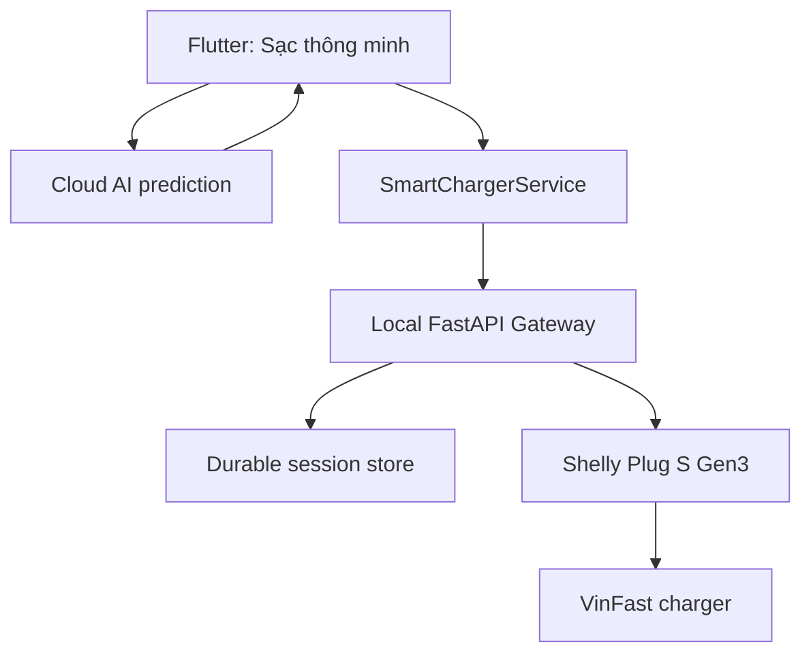
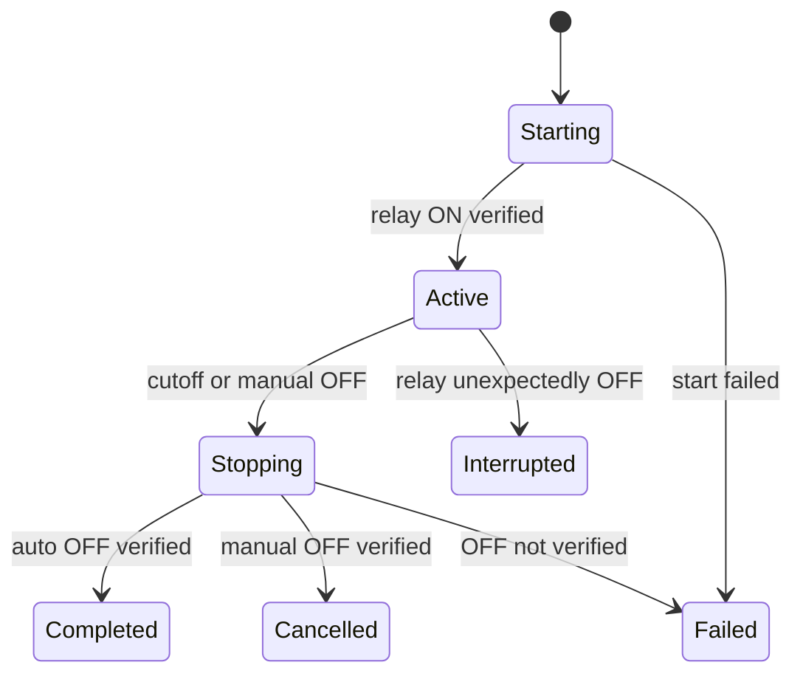

# STEP 9 — AI Target Charging & Smart Charge Control

## 1. Mục đích tài liệu

Đây là Implementation Plan dành cho coding agent triển khai một chức năng sạc thông minh hoàn chỉnh ngay trong ứng dụng Flutter của repository `khanhbes/Vinfast-Batery`.

Chức năng mới cho phép người dùng:

- xem trạng thái Shelly và thông số điện trực tiếp trong app;
- bật hoặc tắt sạc thủ công;
- nhập phần trăm pin hiện tại;
- chọn phần trăm pin mong muốn;
- chọn thời lượng sạc hoặc thời điểm phải dừng sạc;
- nhận ETA và kế hoạch sạc do AI đề xuất;
- xác nhận bắt đầu một phiên sạc có tự động ngắt;
- đóng app mà phiên sạc và lệnh ngắt vẫn tiếp tục chạy tại local gateway;
- xem lý do kết thúc, điện năng đã dùng và lịch sử phiên sạc.

Step 9 kế thừa toàn bộ Step 8. Không xây một ứng dụng mới và không thay thế các cloud service hiện hữu.

---

## 2. Hiện trạng bắt buộc phải giữ nguyên

Agent phải đọc code hiện tại trước khi sửa và xác nhận tên/path thực tế. Hiện trạng đã được nghiệm thu từ Step 8 gồm:

- Flutter có `SmartChargerStatus`, `SmartChargingSession` và `SmartChargerService` typed;
- Flutter gọi local gateway bằng `SMART_CHARGER_API_BASE_URL` qua `--dart-define`;
- timeout LAN là 3 giây;
- `SmartChargerCard` hiển thị W/V/A/Hz/°C/Wh, relay, stale và offline;
- polling 5 giây, không chồng request và dispose timer đúng;
- ON cần xác nhận, OFF thực hiện trực tiếp, sau lệnh đều đọc lại status;
- gateway có status, ON, OFF và session `monitor_only`;
- gateway offline không làm cloud AI prediction thất bại;
- fallback dùng dung lượng pin chuẩn `2400 Wh`, không còn `72 kWh`;
- prediction lưu timestamp thật, model source và confidence;
- `ApiService`, `web/server.py` và class `SmartChargingService` hiện hữu không bị thay đổi sai mục đích;
- cleartext HTTP LAN chỉ được phép trong debug build;
- automatic cutoff chưa tồn tại.

Không được làm mất hoặc hạ chất lượng bất kỳ hành vi nào ở trên.

---

## 3. Sự thật kỹ thuật phải thể hiện đúng trong sản phẩm

Shelly Plug S Gen3 không đọc được SOC từ BMS của xe. Shelly chỉ cung cấp relay, W, V, A, Hz, nhiệt độ và điện năng.

Do đó:

- `% pin hiện tại` là dữ liệu do người dùng nhập hoặc lấy từ một nguồn vehicle/BMS riêng nếu sau này có tích hợp;
- `% pin đang sạc` trong app chỉ là ước tính;
- `% pin mục tiêu` là mục tiêu dự đoán, không phải phép đo trực tiếp;
- không được hiển thị các câu như “pin đã chính xác 80%” nếu không có dữ liệu BMS;
- UI phải dùng nhãn `Ước tính`, `Dự kiến` hoặc ký hiệu `~` ở mọi SOC được suy ra;
- AI không được trực tiếp gửi lệnh relay. AI chỉ tạo kế hoạch; gateway áp dụng kế hoạch sau khi người dùng xác nhận.

Đây là điều kiện nghiệm thu bắt buộc, không phải ghi chú tùy chọn.

---

## 4. Phạm vi chức năng

### 4.1 Trong phạm vi

1. Màn hình `Sạc thông minh` riêng trong Flutter.
2. Khối điều khiển ON/OFF nhanh.
3. Form chọn SOC hiện tại và SOC mục tiêu.
4. Chọn thời gian theo hai kiểu:
   - thời lượng, ví dụ 30 phút, 1 giờ, 2 giờ hoặc tùy chỉnh;
   - thời điểm dừng, ví dụ 22:30 hôm nay hoặc 06:30 ngày mai.
5. Ba chiến lược:
   - `target_soc`: ngắt theo ETA mà AI dự đoán cho SOC mục tiêu;
   - `deadline`: ngắt đúng hạn chót do người dùng chọn;
   - `smart_combined`: ngắt tại điều kiện đến trước giữa ETA mục tiêu và hạn chót.
6. `smart_combined` là mặc định và được gắn nhãn `Khuyên dùng`.
7. Xem trước kế hoạch trước khi bật relay.
8. Cảnh báo khi thời gian không đủ để đạt SOC mục tiêu.
9. Phiên sạc chạy bền vững trong local gateway.
10. Tự động OFF theo kế hoạch đã xác nhận.
11. Manual OFF có ưu tiên cao nhất.
12. Lưu và hiển thị lịch sử phiên sạc cục bộ.
13. Feature flag và giai đoạn shadow mode trước khi bật auto-cutoff thật.
14. Bảo vệ API điều khiển bằng token local, không commit secret.
15. Đồng bộ với phiên bản mới nhất của repository GitHub trước khi triển khai.
16. Audit và cải tiến UI/UX toàn app theo một design system thống nhất.
17. Thêm motion/animation có chủ đích cho tap, chuyển trang và thay đổi trạng thái.
18. Kiểm thử responsive, accessibility và hiệu năng animation trên thiết bị thật.

### 4.2 Ngoài phạm vi

- Không tuyên bố đọc SOC thật từ xe.
- Không cho Flutter gọi Shelly RPC trực tiếp.
- Không chuyển điều khiển Shelly lên `web/server.py` hoặc cloud.
- Không huấn luyện lại model AI trong Step 9.
- Không tự động bật sạc khi app khởi động, reconnect hoặc gateway reboot.
- Không tự động bật lại relay sau mất điện/mất mạng.
- Không dùng một ngưỡng công suất thấp duy nhất để kết luận pin đã đầy.
- Không tự động kéo dài thời gian sạc chỉ vì AI vừa đưa ra ETA dài hơn.
- Không hỗ trợ release HTTP LAN không mã hóa như một cấu hình production chung.
- Không sửa các lỗi analyzer/test cũ không liên quan đến feature này.

---

## 5. Quy tắc sản phẩm và ngữ nghĩa thời gian

### 5.1 Hạn chót cứng

Mọi input thời lượng hoặc giờ dừng đều được chuẩn hóa thành `hardStopAt` dạng UTC ISO-8601.

Ví dụ người dùng ở Việt Nam chọn `06:30 ngày mai`:

- app hiển thị và cho chọn theo timezone local;
- request gửi timestamp có timezone/UTC rõ ràng;
- gateway lưu UTC;
- app chuyển về timezone local khi hiển thị.

Không gửi chuỗi chỉ có `06:30` vì sẽ mơ hồ về ngày và timezone.

### 5.2 Cách tính thời điểm ngắt

Với `target_soc`:

```text
aiTargetStopAt = sessionStartedAt + aiPredictedDuration
effectiveStopAt = aiTargetStopAt
```

Với `deadline`:

```text
effectiveStopAt = hardStopAt
```

Với `smart_combined`:

```text
aiTargetStopAt = sessionStartedAt + aiPredictedDuration
effectiveStopAt = min(aiTargetStopAt, hardStopAt)
```

Ngoài ra phải có `absoluteSafetyStopAt` cấu hình tại gateway. Đây là thời lượng tối đa tuyệt đối của một phiên, dùng để phòng request lỗi hoặc timestamp bất thường. Giá trị cụ thể phải đặt bằng cấu hình sau khi kiểm tra bộ pin/bộ sạc thật; không chôn một con số tùy ý trong code.

Thời điểm OFF thực tế là điều kiện đến trước trong:

```text
effectiveStopAt
absoluteSafetyStopAt
manual OFF
hardware/software safety stop
```

### 5.3 Trường hợp không đủ thời gian

Nếu AI dự đoán cần 100 phút nhưng hạn chót chỉ còn 60 phút:

- không âm thầm giả vờ rằng mục tiêu vẫn đạt được;
- hiển thị `Không đủ thời gian để đạt ~80%`;
- hiển thị thời lượng thiếu;
- nếu có thể tính hợp lệ, hiển thị SOC dự kiến tại deadline với nhãn ước tính;
- cho người dùng chọn một trong ba hành động:
  1. giữ SOC mục tiêu và dời hạn chót;
  2. giữ hạn chót và chấp nhận SOC có thể thấp hơn;
  3. hủy thiết lập.

Chỉ tạo phiên sau khi người dùng xác nhận lựa chọn.

---

## 6. Kiến trúc đích



Phân quyền trách nhiệm:

| Thành phần | Trách nhiệm |
| --- | --- |
| Flutter | Thu input, gọi AI, giải thích kế hoạch, lấy xác nhận, hiển thị phiên và gửi command có chủ đích |
| Cloud AI | Dự đoán thời lượng/ETA và trả source/confidence; không điều khiển relay |
| Local gateway | Nguồn sự thật của phiên, scheduler, lưu trạng thái, ra lệnh OFF và xác minh relay |
| Shelly | Đo điện và đóng/ngắt relay |

Timer trong Flutter chỉ phục vụ hiển thị đếm ngược. Timer này tuyệt đối không phải cơ chế ngắt sạc cuối cùng.

---

## 7. Thiết kế giao diện Flutter

### 7.1 Điểm vào

Giữ `SmartChargerCard` hiện tại ở `AiChargingPredictorScreen`. Bổ sung nút:

```text
Thiết lập sạc thông minh
```

Nút mở một màn hình riêng `SmartChargingControlScreen`. Không nhồi toàn bộ form và lifecycle phiên vào file AI screen hiện tại.

Nếu app đã có router/navigation convention thì dùng đúng convention đó. Không thêm framework điều hướng mới chỉ cho feature này.

### 7.2 Cấu trúc màn hình

Màn hình gồm bốn vùng theo thứ tự:

1. `Trạng thái thiết bị`
   - Online/offline/stale.
   - Relay ON/OFF.
   - W/V/A/Hz/°C/Wh.
   - Thời điểm cập nhật gần nhất.

2. `Điều khiển nhanh`
   - Nút `Bật sạc` có confirmation.
   - Nút `Tắt sạc` thực hiện ngay.
   - Nếu có phiên active, manual OFF phải ghi rõ rằng thao tác sẽ kết thúc phiên.

3. `Thiết lập mục tiêu`
   - SOC hiện tại: input số hoặc slider, 0–100%.
   - SOC mục tiêu: slider, lớn hơn SOC hiện tại, tối đa 100%.
   - Bước slider đề xuất 5%, nhưng cho phép nhập số nguyên hợp lệ.
   - Kiểu thời gian: `Thời lượng` hoặc `Giờ dừng`.
   - Preset: 30 phút, 1 giờ, 2 giờ và `Tùy chỉnh`.
   - Strategy: `Theo %`, `Theo thời gian`, `Kết hợp`.
   - `Kết hợp` được chọn mặc định.

4. `Kế hoạch AI` hoặc `Phiên đang sạc`
   - Trước khi bắt đầu: duration, ETA, effective stop time, confidence, source, cảnh báo.
   - Khi active: trạng thái, thời gian còn lại, SOC ước tính, live power, energy delta, lý do sẽ ngắt.
   - Khi kết thúc: kết quả OFF đã xác minh, stop reason, duration và energy session.

### 7.3 Luồng xem trước và xác nhận

Nút chính ban đầu là `Tạo kế hoạch`.

Sau khi AI trả kết quả, hiển thị summary:

```text
Hiện tại:             35%
Mục tiêu:             ~80%
AI dự đoán:           1 giờ 42 phút
Hạn chót:             22:30
Dự kiến tự ngắt:      22:12
Nguồn dự đoán:        <modelSource>
Độ tin cậy:           78%
```

Nút tiếp theo là `Xác nhận và bắt đầu sạc`.

Confirmation phải nói rõ:

- đây là SOC ước tính nếu chưa có BMS;
- relay sẽ được bật ngay;
- gateway sẽ tự tắt tại `effectiveStopAt` hoặc sớm hơn nếu người dùng/safety rule yêu cầu;
- thiết bị chạy gateway phải luôn bật và không sleep trong phiên.

### 7.4 Trạng thái UI bắt buộc

Agent phải thiết kế rõ các trạng thái:

- initial;
- loading gateway;
- gateway offline;
- Shelly stale;
- loading AI prediction;
- AI prediction failed nhưng manual time mode vẫn dùng được;
- plan ready;
- insufficient time;
- confirmation pending;
- starting session;
- active session;
- stopping;
- completed;
- cancelled manually;
- automatic OFF failed;
- interrupted vì relay đã OFF ngoài dự kiến;
- session restored sau khi mở lại app.

Không dùng một biến boolean duy nhất để đại diện tất cả trạng thái.

### 7.5 Accessibility và định dạng

- Không chỉ dùng màu xanh/đỏ để biểu thị ON/OFF; luôn có text và icon.
- Button phải có trạng thái disabled/loading rõ ràng.
- Tôn trọng text scaling.
- Format số điện theo locale nhưng model luôn giữ `double`.
- Dùng `DateTime` thật trong state/model, chỉ format ở presentation.
- Không lưu `HH:mm` như nguồn sự thật.

---

## 8. Domain model Flutter

Agent nên tạo hoặc mở rộng các typed model dưới `app/lib/data/models/` và feature domain phù hợp với convention repo.

### 8.1 Enums

```dart
enum ChargingStrategy {
  targetSoc,
  deadline,
  smartCombined,
}

enum ChargingSessionState {
  starting,
  active,
  stopping,
  completed,
  cancelled,
  failed,
  interrupted,
}

enum ChargingStopReason {
  aiTargetTime,
  hardDeadline,
  absoluteSafetyLimit,
  manualOff,
  safetyTemperature,
  safetyPower,
  relayMismatch,
  gatewayRestartExpired,
  commandFailed,
}
```

Tên JSON phải được map tường minh; không phụ thuộc vào `enum.toString()`.

### 8.2 `SmartChargingPlanDraft`

Client-only model:

- `currentSoc`;
- `targetSoc`;
- `strategy`;
- `timeInputMode`;
- `requestedDuration` hoặc `requestedStopAt`;
- `batteryCapacityWh`, lấy từ vehicle spec/cấu hình hiện hữu, fallback hợp lệ là 2400 Wh;
- charger mode nếu API AI hiện cần;
- timezone.

Validate:

- SOC là số hữu hạn trong 0–100;
- target > current đối với mode có target;
- deadline nằm trong tương lai;
- duration dương;
- không cho submit nếu gateway đang offline đối với thao tác start;
- không dùng fallback 72 kWh.

### 8.3 `SmartChargingPlanPreview`

- draft đã chuẩn hóa;
- `aiPredictedDuration`;
- `aiTargetStopAt`;
- `hardStopAt`;
- `effectiveStopAt`;
- `predictionSource`;
- `predictionConfidence`;
- `isDeadlineFeasible`;
- `estimatedSocAtDeadline` nullable;
- warning codes typed;
- `createdAt`.

### 8.4 `SmartChargingSessionRequest`

Mở rộng model Step 8, không tạo hai model trùng nghĩa:

- `strategy`;
- `currentSoc`;
- `targetSoc` nullable với deadline-only;
- `socSource = user_input | vehicle_api`;
- `socIsEstimated = true` nếu không có BMS;
- `hardStopAt`;
- `aiPredictedDurationMin` nullable;
- `aiTargetStopAt` nullable;
- `predictionSource` nullable;
- `predictionConfidence` nullable;
- `batteryCapacityWh`;
- `algorithmVersion`;
- `idempotencyKey` UUID;
- `acknowledgedEstimatedSoc`;
- `startRelay = true` chỉ sau confirmation;
- client timestamp và timezone.

Không cho caller gửi `effectiveStopAt` làm nguồn sự thật duy nhất. Gateway phải tự tính lại từ các trường đầu vào và validate.

### 8.5 `SmartChargingSession`

Response/current session model:

- `sessionId`;
- `version`;
- toàn bộ input đã chuẩn hóa;
- `state`;
- `startedAt`;
- `effectiveStopAt`;
- `absoluteSafetyStopAt`;
- `remainingSeconds` có thể tính ở client;
- `relayVerifiedOnAt`;
- `relayVerifiedOffAt`;
- `baselineEnergyWh`;
- `latestEnergyWh`;
- `sessionEnergyWh`;
- `estimatedSoc` nullable;
- `stopReason` nullable;
- `errorCode/errorMessage` nullable;
- `createdAt/updatedAt/completedAt`.

Parsing phải chịu được field mới từ server nhưng phải fail typed đối với field bắt buộc sai kiểu.

---

## 9. Controller và service trong Flutter

### 9.1 Tách controller khỏi widget

Tạo `SmartChargingController` theo state-management convention đang có trong app. Nếu repo đang dùng Riverpod cho feature tương tự, dùng Riverpod và dependency injection; không đưa network call, timer và state machine trực tiếp vào widget.

Controller chịu trách nhiệm:

- load status/current session song song nhưng chống request chồng;
- validate draft;
- gọi cloud prediction qua adapter của `ApiService` hiện hữu;
- tạo preview;
- gửi start session sau confirmation;
- poll status/session;
- manual ON/OFF;
- cancel active session;
- restore current session khi mở screen/app;
- dừng timer/subscription khi dispose.

### 9.2 Không ghép hai service trùng tên

Giữ `SmartChargerService` cho hardware/gateway LAN.

Không đổi hoặc lạm dụng class `SmartChargingService` hiện hữu nếu class đó đang phục vụ tính toán/historical ETA. Nếu cần, tạo adapter tên rõ nghĩa như:

```text
ChargingPredictionAdapter
```

Adapter gọi method prediction hiện có của `ApiService` và map kết quả thành `SmartChargingPlanPreview`.

### 9.3 Hành vi khi AI/cloud lỗi

- `deadline` mode vẫn có thể hoạt động mà không cần AI, sau cảnh báo rõ ràng.
- `target_soc` không được tự động bắt đầu nếu không có AI/fallback được kiểm thử.
- `smart_combined` có thể cho người dùng chuyển sang deadline-only.
- Không để gateway offline làm request AI thất bại.
- Không để AI offline làm manual OFF thất bại.

Nếu dùng fallback vật lý:

```text
energyNeededWh = batteryCapacityWh * (targetSoc - currentSoc) / 100
durationHours = energyNeededWh / effectiveChargePowerW
```

`effectiveChargePowerW` phải đến từ cấu hình/charger spec hoặc median của các mẫu công suất hợp lệ, có efficiency được cấu hình và test. Không dùng một magic number không chú thích. Fallback response phải có `predictionSource = physics_fallback` và confidence thấp hơn model thật.

### 9.4 Re-plan

Trong phiên đầu tiên, không tự động kéo dài `effectiveStopAt` chỉ vì một prediction mới dài hơn.

- cập nhật làm thời điểm ngắt sớm hơn: có thể cho phép nếu rule đã được test và UI thông báo;
- cập nhật làm thời điểm ngắt muộn hơn: bắt buộc người dùng xác nhận;
- mọi update dùng `sessionId + expectedVersion` để tránh ghi đè race;
- không bao giờ vượt `hardStopAt` hoặc `absoluteSafetyStopAt`.

P0 có thể không hỗ trợ re-plan live. Nếu chưa hỗ trợ thì khóa plan tại lúc bắt đầu và ghi rõ trong UI; không để logic nửa vời.

---

## 10. API contract mới của local gateway

Giữ các endpoint Step 8 để tương thích:

```text
GET  /api/charger/status
POST /api/charger/on
POST /api/charger/off
POST /api/charging/session
GET  /api/charging/session/current
```

Không thay đổi ngữ nghĩa endpoint `POST /api/charging/session` cũ một cách âm thầm. Session `monitor_only` cũ phải tiếp tục chạy.

Thêm các endpoint có chủ đích rõ ràng:

```text
POST  /api/charging/session/start
GET   /api/charging/session/{session_id}
PATCH /api/charging/session/{session_id}
POST  /api/charging/session/{session_id}/stop
GET   /api/charging/sessions?limit=20
```

### 10.1 `POST /api/charging/session/start`

Yêu cầu:

- bearer token hợp lệ;
- `Idempotency-Key` hoặc `idempotencyKey` hợp lệ;
- không có session active khác;
- timestamp hợp lệ và chưa hết hạn;
- `acknowledgedEstimatedSoc = true` nếu SOC không đến từ BMS;
- `ENABLE_AUTOMATIC_CUTOFF=true` nếu request không phải shadow mode;
- Shelly online;
- relay status đọc được trước khi thao tác.

Trình tự transaction logic:

1. validate request;
2. tính `effectiveStopAt` tại server;
3. lưu session ở state `starting`;
4. gọi Shelly ON một lần;
5. đọc lại status;
6. chỉ chuyển `active` khi relay thực sự ON;
7. nếu ON hoặc verify thất bại, cố gắng OFF an toàn, đánh dấu failed và trả lỗi typed;
8. response trả session đầy đủ.

Request lặp cùng idempotency key phải trả cùng session, không bật relay lần hai.

### 10.2 `POST /api/charging/session/{id}/stop`

Manual OFF phải:

1. chiếm command lock;
2. đánh dấu `stopping`;
3. gọi Shelly OFF;
4. đọc lại status với retry giới hạn;
5. chỉ đánh dấu `cancelled/manual_off` khi relay đã OFF;
6. nếu không xác minh được, trả lỗi nghiêm trọng và giữ state phản ánh `command_failed` thay vì báo thành công giả.

Endpoint phải idempotent: gọi stop nhiều lần vẫn an toàn.

### 10.3 `PATCH`

- yêu cầu `expectedVersion`;
- trả 409 nếu version mismatch;
- không sửa session terminal;
- không được dời sau hard deadline;
- extension cần `userConfirmedExtension=true`;
- persist trước khi response.

### 10.4 Error schema

Mọi lỗi gateway dùng schema ổn định:

```json
{
  "error": {
    "code": "ACTIVE_SESSION_EXISTS",
    "message": "Another charging session is active",
    "retryable": false,
    "session_id": "..."
  }
}
```

Không bắt Flutter parse nội dung chuỗi `detail` để xác định loại lỗi.

Các code tối thiểu:

- `GATEWAY_AUTH_REQUIRED`;
- `INVALID_CHARGING_PLAN`;
- `DEADLINE_EXPIRED`;
- `ACTIVE_SESSION_EXISTS`;
- `AUTOMATIC_CUTOFF_DISABLED`;
- `SHELLY_UNAVAILABLE`;
- `RELAY_ON_NOT_VERIFIED`;
- `RELAY_OFF_NOT_VERIFIED`;
- `SESSION_NOT_FOUND`;
- `SESSION_VERSION_CONFLICT`;
- `SESSION_TERMINAL`.

---

## 11. Gateway scheduler và state machine

### 11.1 State machine



Terminal state không được quay lại `active`.

### 11.2 Background task

Dùng FastAPI lifespan để tạo một scheduler task duy nhất. Không tạo một timer riêng không quản lý cho mỗi request.

Scheduler:

- tick đủ ngắn để đáp ứng cutoff, ví dụ 1 giây, nhưng polling Shelly vẫn có cadence riêng để tránh spam thiết bị;
- dùng lock chung cho ON/OFF/session transition;
- dùng UTC timestamp để phục hồi sau restart;
- có thể dùng monotonic clock trong process cho countdown, nhưng durable source vẫn là UTC;
- shutdown phải cancel/await task sạch sẽ;
- exception trong một vòng lặp không được làm chết scheduler vĩnh viễn;
- log structured với `session_id`, action và result, không log token.

### 11.3 Quy trình auto OFF

Khi tới cutoff:

1. acquire command/session lock;
2. re-read session mới nhất;
3. bỏ qua nếu session không còn active;
4. chuyển sang `stopping` và persist;
5. gọi Shelly OFF;
6. retry đọc relay với giới hạn thời gian;
7. persist `relayVerifiedOffAt` và terminal state;
8. ghi stop reason chính xác;
9. nếu verify thất bại, persist failed state và tiếp tục retry OFF theo policy giới hạn, không báo completed.

OFF là idempotent. Race giữa manual OFF và timer phải kết thúc ở đúng một terminal state có lý do ưu tiên xác định.

Thứ tự ưu tiên stop reason:

```text
safety stop > manual OFF > hard deadline > AI target ETA
```

### 11.4 Relay bị đổi ngoài hệ thống

- Session active nhưng relay bỗng OFF: đánh dấu `interrupted`, không tự bật lại.
- Relay ON nhưng không có active session: hiển thị `unmanaged_on`; không giả tạo session AI.
- Gateway restart và relay đang OFF: không tự ON, session cũ thành `interrupted` nếu chưa terminal.
- Gateway restart và relay đang ON, session active còn hạn: phục hồi monitoring và cutoff, không gửi ON lần nữa.
- Gateway restart, session đã quá hạn và relay ON: ưu tiên OFF ngay rồi xác minh, reason `gateway_restart_expired`.

---

## 12. Lưu trữ bền vững

Không chỉ giữ active session trong RAM. Dùng SQLite chuẩn thư viện Python hoặc storage bền vững tương đương có transaction.

Đề xuất:

```text
smart_charger_gateway/
  app/
    session_store.py
    scheduler.py
    schemas.py
    charger_controller.py
  data/
    .gitkeep
```

DB path lấy từ environment, ví dụ `SMART_CHARGER_DB_PATH`; file DB thật phải nằm trong `.gitignore`.

Tối thiểu lưu:

- session/request normalized;
- idempotency key unique;
- version;
- timestamps;
- state/stop reason;
- baseline/latest/session energy;
- prediction metadata;
- relay verification timestamps;
- failure information.

Mỗi transition phải atomic. Không để response báo thành công trước khi state cần thiết được persist.

History API mặc định trả mới nhất trước, có limit được chặn biên và không trả secret.

---

## 13. Ước tính SOC và năng lượng phiên

Khi session bắt đầu, lưu `baselineEnergyWh` từ Shelly. Trong phiên:

```text
sessionEnergyWh = max(0, latestEnergyWh - baselineEnergyWh)
```

Nếu energy counter reset/giảm:

- không tạo energy âm;
- ghi quality flag;
- bắt đầu segment mới hoặc đánh dấu metric không liên tục;
- không dùng dữ liệu lỗi để kết luận SOC.

SOC hiển thị có thể ước tính từ năng lượng:

```text
estimatedSoc = currentSoc
  + sessionEnergyWh * configuredEfficiency / batteryCapacityWh * 100
```

Nhưng trong bản phát hành đầu tiên:

- chỉ dùng SOC năng lượng để hiển thị và ghi dữ liệu;
- không dùng một mình nó làm trigger OFF cho tới khi đã hiệu chuẩn bằng charging curve thật;
- gắn nhãn `~` và quality/confidence;
- clamp phần hiển thị 0–100 nhưng giữ raw diagnostic nội bộ cho test/debug.

Không dùng `aenergy.total` như thể đó là năng lượng riêng của phiên nếu chưa trừ baseline.

---

## 14. An toàn và bảo mật

### 14.1 Feature flags

Gateway phải có:

```text
ENABLE_SMART_CHARGING=true|false
ENABLE_AUTOMATIC_CUTOFF=true|false
SMART_CHARGER_SHADOW_MODE=true|false
```

Mặc định khi merge code lần đầu:

```text
ENABLE_SMART_CHARGING=true
ENABLE_AUTOMATIC_CUTOFF=false
SMART_CHARGER_SHADOW_MODE=true
```

Shadow mode chạy toàn bộ plan/scheduler nhưng khi đến cutoff chỉ ghi `would_have_turned_off_at`; không gửi OFF tự động. Manual OFF vẫn hoạt động.

Chỉ bật live cutoff sau khi shadow acceptance test đạt.

### 14.2 Gateway luôn phải hoạt động

Nếu gateway chạy trên laptop và laptop sleep, scheduler không thể ngắt đúng giờ. UI phải cảnh báo điều này trước khi bắt đầu.

Để dùng thực tế lâu dài:

- chạy gateway trên Raspberry Pi/mini PC luôn bật, hoặc
- cấu hình Windows không sleep trong lúc có phiên active bằng quy trình vận hành rõ ràng.

Không tự ý thay đổi power policy hệ điều hành trong code.

### 14.3 Authentication local

Trước khi bật auto control:

- gateway yêu cầu bearer token cho status và command endpoint;
- token sinh ngoài source code và lấy từ environment/secret file local;
- Flutter lưu token bằng secure storage hoặc cơ chế secret phù hợp hiện có;
- không hard-code token trong Dart, manifest, test fixture thật hoặc git;
- không log Authorization header;
- trả 401/403 typed;
- bind gateway vào LAN cần thiết, không expose port trực tiếp ra Internet.

Với prototype một người dùng, có thể nhập token ở màn Settings. Pairing/QR có thể là phase sau, nhưng code phải tách authentication để nâng cấp được.

### 14.4 Safety configuration

Các ngưỡng nhiệt độ, công suất, dòng điện và session duration phải được cấu hình từ thông số Shelly/charger thật. Không tự chọn ngưỡng “có vẻ hợp lý”.

Nếu software safety trigger:

- chỉ cho phép hành động tự động là OFF;
- ghi stop reason;
- khóa automatic ON cho đến khi người dùng xác nhận đã kiểm tra;
- UI hiển thị lỗi nổi bật.

Shelly hardware protection vẫn là lớp an toàn độc lập; software không được vô hiệu hóa bảo vệ thiết bị.

---

## 15. Polling và đồng bộ app–gateway

Khi screen foreground:

- status Shelly: giữ cadence Step 8 khoảng 5 giây;
- current session: 2–5 giây tùy tải;
- countdown hiển thị: tick local mỗi giây, định kỳ đồng bộ lại từ server;
- không tạo request mới khi request cùng loại chưa hoàn thành;
- khi app background, không dựa vào app timer để OFF;
- khi resume, fetch `current session` trước rồi render state;
- network error giữ last known data với nhãn stale, không tự chuyển relay state giả.

Gateway là nguồn sự thật. Nếu local UI state mâu thuẫn với gateway, lấy gateway state và hiển thị thông báo phiên đã thay đổi.

---

## 16. Notifications

Trong phạm vi tối thiểu:

- notification khi phiên bắt đầu;
- notification dự kiến sắp ngắt nếu app/background capability cho phép;
- notification khi app nhận được trạng thái completed/cancelled/failed.

Không hứa local notification chính xác nếu app bị kill và không có background mechanism đáng tin cậy. Lệnh OFF không được phụ thuộc notification.

Push notification từ gateway không thuộc P0. Nếu chưa có channel đáng tin cậy, history/current state phải cho người dùng biết kết quả ngay khi mở lại app.

---

## 17. Đồng bộ và audit repository GitHub

Repository nguồn:

```text
https://github.com/khanhbes/Vinfast-Batery
```

Agent không được triển khai dựa trên cấu trúc file ghi trong plan như thể đó là trạng thái mới nhất. Repository tại thời điểm chạy agent mới là nguồn sự thật.

### 17.1 Quy trình đồng bộ bắt buộc

Nếu chưa có repository local:

```powershell
git clone https://github.com/khanhbes/Vinfast-Batery.git
cd Vinfast-Batery
```

Nếu đã có repository local:

1. chạy `git status --short --branch`;
2. ghi nhận mọi file modified/untracked của người dùng;
3. không reset, checkout hoặc xóa thay đổi chưa commit;
4. chạy `git remote -v` và xác nhận `origin` đúng repository trên;
5. chạy `git fetch --all --prune`;
6. xác định base branch thực tế từ remote, không giả định luôn là `main`;
7. chỉ pull/rebase khi worktree sạch hoặc đã có phương án giữ nguyên thay đổi của người dùng;
8. ghi lại base commit bằng `git rev-parse HEAD` và remote commit tương ứng;
9. tạo feature branch riêng theo convention repo, ví dụ `feature/ai-target-charging-uiux`, nếu người dùng chưa chỉ định branch khác;
10. không force-push và không push nếu người dùng chưa yêu cầu agent thực hiện thao tác remote.

Nếu local có thay đổi chồng lên file cần sửa, agent phải dừng việc ghi đè, báo chính xác file xung đột và giữ nguyên nội dung người dùng.

### 17.2 Repository audit trước khi code

Agent phải đọc tối thiểu:

- mọi `AGENTS.md`/instruction file áp dụng;
- root README và `.gitignore`;
- `app/pubspec.yaml` và lockfile;
- Flutter entrypoint, router/navigation và app shell;
- toàn bộ theme, color, typography và reusable widget hiện có;
- các screen/page và navigation destination hiện có;
- `AiChargingPredictorScreen`;
- toàn bộ Step 8 models/services/widgets/tests;
- Android debug/main/release manifests;
- `smart_charger_gateway` entrypoint, schemas, session code và tests;
- cloud prediction contract mà Flutter đang gọi;
- CI/workflow/build scripts liên quan.

Không thêm package UI/animation trước khi kiểm tra dependency hiện có. Không tạo `AppColors`, `AppTheme` hoặc router thứ hai nếu repo đã có abstraction tương đương.

### 17.3 Báo cáo audit bắt buộc

Trước khi sửa code, agent phải tạo một ghi chú ngắn trong handoff hoặc implementation log gồm:

| Nội dung | Kết quả cần ghi |
| --- | --- |
| Base branch | Tên branch thực tế |
| Base commit | Full commit SHA |
| Worktree | Sạch hay có thay đổi của người dùng |
| Flutter version | Version thực tế dùng để test/build |
| State management | Pattern/package đang dùng |
| Navigation | Router/API đang dùng |
| Theme system | File/tokens/components hiện hữu |
| Step 8 | File và test đã tồn tại |
| Gateway API | Contract thực tế hiện tại |
| Known failures | Analyzer/test lỗi nền trước khi sửa |

Sau audit, agent phải cập nhật mapping giữa tên khái niệm trong plan và path thực tế. Nếu tên class/file khác plan, ưu tiên kiến trúc repo và ghi rõ mapping, không tạo duplicate chỉ để khớp tên tài liệu.

### 17.4 Đồng bộ trong quá trình triển khai

- Chia thay đổi thành commit logic nhỏ nếu được phép commit.
- Trước handoff, fetch remote thêm một lần để phát hiện thay đổi mới.
- Nếu remote tiến lên nhưng không xung đột, rebase/merge theo workflow repo rồi chạy lại test.
- Nếu remote thay đổi cùng file, không tự giải quyết bằng cách bỏ nội dung của một phía; báo diff/xung đột và bảo toàn hành vi Step 8.
- Handoff phải ghi `tested commit SHA`, branch và danh sách file thay đổi.
- Generated files, DB local, secret và build artifacts không được commit.

---

## 18. Cải tiến UI/UX và motion system toàn app

Mục tiêu không phải chỉ làm màn sạc mới đẹp hơn. Agent phải audit toàn bộ app, tạo nền UI/UX thống nhất và áp dụng trước hết cho app shell, navigation, AI predictor, Smart Charger và các shared component. Những screen còn lại phải được lập inventory và migrate có kiểm soát, không sửa hàng loạt mù quáng.

### 18.1 Nguyên tắc cải tiến

1. Giữ nhận diện hiện có nếu app đã có brand/theme rõ ràng.
2. Dùng một design system chung thay vì hard-code từng screen.
3. Ưu tiên hierarchy, khả năng đọc, feedback và trạng thái lỗi trước hiệu ứng trang trí.
4. Motion phải giải thích quan hệ hoặc phản hồi thao tác; không animation chỉ để “trông nhiều hiệu ứng”.
5. Không để animation trì hoãn manual OFF hoặc che khuất lỗi an toàn.
6. Giữ trải nghiệm tốt trên máy Android tầm trung, màn hình nhỏ và mạng LAN chập chờn.
7. Tôn trọng reduced motion/accessibility setting.

### 18.2 Inventory toàn app

Agent dùng `rg --files` và code navigation để lập danh sách mọi screen/page/dialog/bottom sheet. Với mỗi màn hình, ghi:

- entry route/navigation destination;
- mục tiêu chính của người dùng;
- primary action;
- empty/loading/error/offline states hiện có;
- vấn đề hierarchy, spacing, typography, contrast;
- component có thể tái sử dụng;
- mức ưu tiên `P0/P1/P2`.

Ưu tiên:

| Mức | Phạm vi |
| --- | --- |
| P0 | App shell, navigation, Home/Dashboard nếu có, AI Predictor, Smart Charger, dialog điều khiển relay |
| P1 | Các screen người dùng đi qua thường xuyên, form và history/detail |
| P2 | Screen quản trị/phụ trợ ít dùng, chỉ migrate sau khi P0/P1 ổn định |

Không xóa hoặc đổi navigation destination chỉ vì muốn làm lại giao diện.

### 18.3 Design tokens

Mở rộng theme hiện hữu hoặc tạo tokens tương đương nếu repo chưa có:

```text
AppColors / ColorScheme
AppTypography / TextTheme
AppSpacing
AppRadii
AppElevation
AppMotionDurations
AppMotionCurves
```

Yêu cầu:

- ưu tiên `ThemeData`/`ColorScheme` và `TextTheme` thay vì gọi màu/font trực tiếp;
- không rải `Color(...)`, padding/radius/duration magic number khắp widget;
- semantic color phải có tên theo vai trò như success/warning/error/online/offline, không theo tên màu thuần;
- light/dark theme phải có contrast hợp lệ nếu app hỗ trợ dark mode;
- shared metric card, status chip, section header, primary/secondary/destructive button và error banner phải dùng component chung;
- không thay toàn bộ brand palette nếu không có yêu cầu thiết kế riêng.

### 18.4 Information architecture màn sạc

Màn `Sạc thông minh` phải làm rõ thứ tự ưu tiên:

1. Relay và kết nối hiện tại.
2. Manual OFF luôn nhìn thấy khi relay ON.
3. Phiên đang active, thời gian còn lại và lý do dự kiến ngắt.
4. Tạo/chỉnh kế hoạch.
5. Metrics điện chi tiết.
6. Lịch sử gần đây.

Không đặt nút ON và OFF có trọng lượng thị giác giống nhau khi relay đang ON. Khi đang sạc, `Tắt sạc` là hành động dễ tìm nhất nhưng phải dùng destructive styling hợp lý, không gây click nhầm.

Form mục tiêu dùng progressive disclosure:

- luôn hiện SOC hiện tại, target và strategy;
- chỉ hiện input thời lượng/giờ theo lựa chọn;
- phần kỹ thuật như source/confidence/Wh có thể nằm trong `Chi tiết dự đoán`;
- cảnh báo SOC ước tính nằm ngay gần target, không chôn ở cuối màn hình.

### 18.5 Component interaction states

Mỗi interactive component phải có đủ:

- default;
- pressed;
- focused;
- disabled;
- loading;
- success/error nếu thao tác async;

Không thay label bằng spinner đến mức button đổi chiều rộng gây layout shift. Với command relay:

```text
idle -> confirming -> sending -> verifying -> success/error
```

UI không được hiển thị thành công ở trạng thái `sending`; phải chờ `verifying` hoàn thành.

### 18.6 Animation khi click/tap

Tạo một primitive tái sử dụng hoặc dùng Material interaction đúng cách. Không bọc mọi thứ bằng `GestureDetector` thiếu ripple/semantics.

Khuyến nghị motion token ban đầu, có thể điều chỉnh sau khi đo trên thiết bị:

| Tương tác | Motion |
| --- | --- |
| Tap card/button | scale nhẹ khoảng 0.98 và/hoặc Material ripple, 80–120 ms |
| Button loading | cross-fade label/icon sang progress, 150–200 ms |
| Success | icon check/fade-scale ngắn, không chặn navigation |
| Error | color/icon transition; tránh rung lắc mạnh |
| Toggle/relay | `AnimatedContainer`/icon transition 180–240 ms, trạng thái verifying riêng |
| Expand detail | `AnimatedSize` 200–260 ms |
| Thay nội dung state | `AnimatedSwitcher` 180–240 ms với stable keys |

Không dùng scale quá lớn, bounce dài hoặc nhiều animation đồng thời cho nút ON/OFF. Haptic feedback chỉ dùng có chủ đích:

- selection feedback cho slider/chip;
- feedback rõ hơn sau manual OFF/relay verified;
- không rung liên tục khi polling hoặc countdown.

### 18.7 Animation chuyển trang

Agent phải dùng navigation system hiện hữu và áp dụng transition thống nhất, không tự tạo route khác nhau ở từng button.

Motion guideline:

- push screen: fade + slide rất nhẹ theo hướng điều hướng, khoảng 200–260 ms;
- pop: đảo chiều tự nhiên và ngắn hơn hoặc bằng push;
- modal/bottom sheet: 240–300 ms;
- tab/bottom navigation: fade-through hoặc chuyển trạng thái nhẹ, không slide toàn màn hình qua quãng đường lớn;
- detail từ `SmartChargerCard`: có thể dùng Hero/shared element chỉ khi không gây duplicate tag, flicker hoặc lỗi back gesture;
- dialog xác nhận relay phải xuất hiện nhanh và giữ focus đúng.

Transition phải:

- hỗ trợ back button/gesture;
- không double-push khi người dùng chạm nhanh;
- không mất state/polling lifecycle;
- không trigger lại network command khi animation rebuild;
- không làm nội dung trắng/nhấp nháy trong lúc đổi route;
- dùng `MediaQuery.disableAnimations` hoặc cơ chế tương đương để giảm/tắt motion khi hệ thống yêu cầu.

Không thêm package animation lớn chỉ để làm fade/slide/scale mà Flutter SDK đã hỗ trợ. Nếu repo đang có animation package, tái sử dụng có kiểm soát.

### 18.8 Animation dữ liệu sạc

- W/V/A/°C cập nhật bằng number transition nhẹ, không animate toàn card mỗi 5 giây.
- Countdown chỉ rebuild text cần thiết, không rebuild toàn screen mỗi giây.
- Thanh tiến độ SOC ước tính dùng `TweenAnimationBuilder` hoặc component tương đương, clamp 0–100.
- Relay đang chuyển đổi có trạng thái pulse/loading hữu hạn; không pulse vô tận khi offline.
- Offline/stale chuyển bằng color/icon/text transition ngắn, không che timestamp cuối cùng.
- Chart/history nếu có chỉ animate lần đầu hoặc thay dataset có chủ đích; polling không replay animation từ đầu.

### 18.9 Responsive layout

Kiểm thử tối thiểu:

- điện thoại Android chiều rộng khoảng 320/360/412 dp;
- text scale 1.0, 1.3 và lớn hơn theo khả năng app;
- portrait và landscape;
- bàn phím mở khi nhập SOC/time;
- tablet/wide layout nếu app hiện hỗ trợ;
- safe area, cutout và system navigation bar.

Không dùng chiều cao cố định cho card chứa text động. Primary action phải không bị keyboard che. Với màn rộng, có thể dùng hai cột cho plan và live metrics nhưng mobile giữ một cột rõ ràng.

### 18.10 Accessibility

- touch target tối thiểu khoảng 48×48 logical pixels;
- contrast text thường mục tiêu tối thiểu 4.5:1;
- icon-only button có tooltip/semantic label;
- relay status đọc được bằng screen reader;
- slider SOC công bố giá trị hiện tại và target;
- thứ tự focus/semantics đúng hierarchy;
- error không chỉ thể hiện bằng màu;
- animation không flash mạnh hoặc gây chóng mặt;
- hỗ trợ reduced motion;
- confirmation không tự đóng trước khi người dùng đọc.

### 18.11 Empty, loading, offline và error UX

Không dùng một spinner toàn màn hình cho mọi request.

- Lần đầu tải: skeleton hoặc placeholder nhẹ theo layout thật.
- Refresh/poll: giữ dữ liệu cũ, gắn `Đang cập nhật` nếu cần.
- Stale: vẫn hiện last known metrics và timestamp.
- Offline: phân biệt Cloud AI offline, gateway offline và Shelly unavailable.
- Empty history: giải thích cách tạo phiên đầu tiên.
- Retry: đặt gần lỗi, không gửi lặp command điều khiển nếu chưa rõ trạng thái.
- Automatic OFF không xác minh được: hiển thị critical banner và hướng dẫn người dùng kiểm tra nguồn/Shelly ngay.

### 18.12 Copywriting tiếng Việt

Chuẩn hóa thuật ngữ trong toàn app:

| Không nên | Nên dùng |
| --- | --- |
| Charger online | Bộ sạc đang kết nối |
| Relay true/false | Công tắc đang bật/tắt |
| Target SOC | Mức pin mong muốn |
| Deadline | Hạn chót dừng sạc |
| Prediction failed | Không thể dự đoán lúc này |
| Completed | Đã kết thúc sạc |

Thông báo lỗi cần nói người dùng nên làm gì. Chi tiết kỹ thuật/error code có thể đặt trong phần mở rộng để debug, không làm nội dung chính khó hiểu.

### 18.13 Hiệu năng motion

Agent phải profile ít nhất trên debug/profile build và một thiết bị/emulator đại diện:

- không có network call trong `build()`;
- không recreate controller/animation controller mỗi rebuild;
- dispose mọi `AnimationController`, timer và subscription;
- giới hạn vùng repaint bằng widget structure hoặc `RepaintBoundary` khi có lợi thực tế;
- tránh blur/shadow lớn liên tục;
- không animate layout của danh sách dài mỗi polling tick;
- kiểm tra frame jank khi mở screen, chuyển trang, bật bottom sheet và cập nhật metrics;
- mục tiêu giữ frame budget phù hợp màn hình 60 Hz và không có jank lặp lại rõ rệt.

Đừng tối ưu mù quáng. Ghi lại màn hình/interaction có jank và thay đổi đã thực hiện.

### 18.14 UI regression tests

Bổ sung:

- widget test cho pressed/loading/disabled/error states;
- navigation test chống double-push và back đúng;
- test reduced motion;
- test text scaling/overflow cho các card chính;
- golden tests cho P0 screen ở trạng thái offline, plan ready, active và failed nếu repo đã có golden infrastructure;
- nếu chưa có golden infrastructure, không thêm hệ thống nặng chỉ vì một ảnh; dùng widget assertions và lưu screenshot QA có kiểm soát;
- manual QA video/screenshot cho tap animation và page transition vì golden test không chứng minh chất lượng motion.

### 18.15 Giới hạn refactor UI

- Không đổi business logic chỉ vì tách widget.
- Không thay navigation package toàn app trong Step 9.
- Không đổi state-management framework toàn app.
- Không thay mọi icon/font/package nếu không có lý do sản phẩm rõ ràng.
- Không sửa đồng thời hàng trăm file bằng format/rewrite không liên quan.
- Migrate shared components trước, sau đó từng screen; mỗi phase phải build/test được.

---

## 19. Thứ tự triển khai bắt buộc

### Phase 0 — Đồng bộ GitHub, baseline và khóa contract

1. Thực hiện đầy đủ quy trình Section 17 và ghi base/tested commit SHA.
2. Chạy `git status`, không ghi đè thay đổi của người dùng.
3. Đọc toàn bộ file Step 8 liên quan, các test và navigation/state-management convention.
4. Inventory screen/component theo Section 18.
5. Ghi lại JSON contract hiện tại của gateway và Flutter model.
6. Xác nhận prediction response thực tế của `ApiService`.
7. Xác nhận battery capacity được lấy từ đâu; giữ fallback 2400 Wh.
8. Chạy baseline gateway tests, Flutter Smart Charger tests và các test mục tiêu.
9. Chụp/ghi nhận baseline UI cho các màn P0 trước khi refactor.
10. Không bắt đầu bằng việc sửa `web/server.py`.

### Phase 1 — Design system và motion foundation

1. Audit theme/tokens/shared widgets hiện có.
2. Chuẩn hóa hoặc bổ sung spacing, radii, semantic colors, typography và motion tokens.
3. Tạo interaction primitive cần thiết nhưng giữ Material semantics/ripple.
4. Áp dụng transition thống nhất qua navigation hiện hữu.
5. Thêm reduced-motion handling.
6. Viết test cho shared component trước khi migrate screen.

### Phase 2 — Domain models và preview thuần túy

1. Thêm enums/models typed.
2. Tạo validator và hàm tính `effectiveStopAt` thuần túy.
3. Tạo prediction adapter.
4. Viết unit test cho timezone, deadline và chiến lược.
5. Chưa gửi ON/OFF tự động.

### Phase 3 — UI màn Sạc thông minh và các P0 surface

1. Tạo screen/controller/widgets.
2. Nối từ `SmartChargerCard`.
3. Hoàn thiện form, preview, impossible-plan warning và confirmation.
4. Nối manual ON/OFF Step 8.
5. Áp dụng tap feedback, state animation, page transition và haptic có chủ đích.
6. Cải tiến app shell/navigation, AI predictor và shared P0 components để đồng bộ giao diện.
7. Viết widget, navigation, reduced-motion và semantics tests.

### Phase 4 — UI/UX migration P1/P2

1. Migrate từng screen theo inventory, ưu tiên P1.
2. Thay hard-code bằng shared tokens/components nhưng không thay business logic.
3. Hoàn thiện loading/empty/error/offline states.
4. Kiểm tra responsive, text scaling và accessibility.
5. Mỗi nhóm screen phải build/test độc lập; không gom một mega-refactor khó review.
6. P2 có thể tách thành follow-up rõ ràng nếu vượt phạm vi an toàn của Step 9, nhưng phải có inventory và tiêu chí hoàn thành.

### Phase 5 — Durable gateway session

1. Thêm schema/state machine/store.
2. Thêm start/stop/get/history API.
3. Thêm authentication và idempotency.
4. Bổ sung scheduler ở shadow mode.
5. Viết unit/integration tests không cần Shelly thật bằng fake client/clock.

### Phase 6 — End-to-end shadow mode

1. Flutter tạo và start shadow session.
2. Gateway có thể ON theo confirmation nhưng không auto OFF ở predicted cutoff trong shadow mode.
3. Gateway ghi `wouldHaveStoppedAt`.
4. Người kiểm thử manual OFF.
5. So sánh predicted cutoff, deadline, actual charging observations.
6. Sửa contract/UX nếu có sai lệch.

Lưu ý: nếu shadow session bật relay, phải có người giám sát và có manual hard stop. Có thể chạy scheduler shadow bằng fake Shelly trước để không cấp điện.

### Phase 7 — Live automatic cutoff

Chỉ bật khi tất cả gate shadow đạt:

1. đặt feature flag live trong môi trường thử nghiệm;
2. chạy phiên ngắn với tải an toàn trước;
3. xác minh OFF và status readback;
4. test app đóng nhưng gateway vẫn OFF;
5. test gateway restart;
6. sau đó mới smoke test với charger VinFast có giám sát.

### Phase 8 — UI QA, documentation và handoff

1. Chạy UI audit cuối và so sánh với baseline P0.
2. Profile tap/page/state animations trên thiết bị đại diện.
3. Ghi screenshot/video QA cho các motion quan trọng.
4. Fetch remote lần cuối và xử lý thay đổi theo Section 17.
5. Cập nhật README gateway/app run command.
6. Viết lệnh `--dart-define` không chứa secret thật.
7. Mô tả cách cấu hình token/flags/database.
8. Mô tả laptop sleep limitation.
9. Lưu API examples đã xóa secret.
10. Ghi known limitations: SOC là estimate, release HTTP LAN và gateway availability.
11. Báo branch, base/tested commit SHA, file thay đổi, test/build result và UI migration còn lại.

---

## 20. Test plan Flutter

### 20.1 Unit tests

Tối thiểu kiểm tra:

1. parse/serialize mọi enum và model;
2. reject SOC ngoài 0–100;
3. reject target <= current;
4. deadline-only không bắt target;
5. reject deadline quá khứ;
6. duration normalize thành đúng UTC deadline;
7. target strategy chọn AI ETA;
8. deadline strategy chọn hard deadline;
9. combined chọn thời điểm đến trước;
10. AI ETA sau deadline tạo insufficient-time warning;
11. confidence/source được giữ nguyên;
12. physics fallback dùng Wh đúng dimension;
13. NaN/infinite/negative duration bị reject;
14. error JSON map thành typed exception;
15. session version conflict được nhận diện;
16. energy delta không âm khi counter reset;
17. SOC estimate luôn được gắn trạng thái estimated.

### 20.2 Controller tests

1. gateway offline không chặn cloud prediction preview;
2. cloud AI offline không chặn manual OFF;
3. double tap Start chỉ gửi một request/idempotency key;
4. start chỉ xảy ra sau confirmation;
5. polling không chồng request;
6. dispose dừng timer;
7. resume fetch current session;
8. stale data không biến thành online giả;
9. manual OFF active session chuyển UI đúng;
10. server session state thắng local stale state.

### 20.3 Widget tests

1. form validation;
2. time mode switching;
3. combined được chọn mặc định;
4. warning không đủ thời gian;
5. confirmation hiển thị ETA/deadline/% ước tính;
6. active session card;
7. automatic OFF failed state;
8. offline/stale state;
9. manual ON confirmation;
10. manual OFF không thêm confirmation thứ hai trừ khi cần báo kết thúc active session;
11. accessibility labels cho relay, buttons và metrics.
12. tap feedback không làm phát sinh duplicate command;
13. page transition không double-push và back đúng;
14. reduced motion tắt/giảm animation trang trí;
15. text scaling không overflow các card P0;
16. loading/state transition giữ stable layout và semantics.

Không dùng network/Shelly thật trong unit/widget tests.

---

## 21. Test plan gateway

Dùng dependency injection cho Shelly client, fake clock và temporary SQLite DB.

Tối thiểu kiểm tra:

1. start request hợp lệ;
2. invalid/expired deadline;
3. auto cutoff feature disabled;
4. auth missing/wrong;
5. idempotent start;
6. active session conflict;
7. relay ON readback success/failure;
8. target/deadline/combined effective stop calculation;
9. scheduler shadow mode không gọi OFF;
10. scheduler live mode gọi OFF đúng hạn;
11. OFF readback thành công mới completed;
12. OFF failure không báo completed;
13. repeated stop idempotent;
14. race manual OFF với scheduler;
15. restart restore active + relay ON;
16. restart active + relay OFF thành interrupted;
17. restart expired + relay ON gọi OFF;
18. không bao giờ auto ON khi restart;
19. relay unexpected OFF;
20. PATCH version conflict;
21. extension không confirmation bị reject;
22. hard deadline không bị vượt;
23. absolute safety limit ưu tiên;
24. session history order/limit;
25. token không xuất hiện trong logs/errors;
26. scheduler exception không giết background task;
27. DB transition atomic qua simulated failure;
28. legacy monitor-only endpoint không gọi Shelly.

---

## 22. Manual acceptance scenarios

### Scenario A — Manual control

- mở app cùng LAN;
- thấy status live;
- ON chỉ sau confirmation;
- status readback là relay ON;
- OFF ngay;
- status readback là relay OFF.

### Scenario B — Combined plan có đủ thời gian

- current 30%, target 80%;
- deadline muộn hơn AI ETA;
- preview chọn AI target time;
- confirm;
- session active;
- tới cutoff gateway OFF và verify;
- history reason `ai_target_time`.

### Scenario C — Deadline đến trước

- AI duration dài hơn thời gian còn lại;
- UI cảnh báo không đủ thời gian;
- người dùng chấp nhận deadline;
- effective stop là deadline;
- history reason `hard_deadline`.

### Scenario D — App bị đóng

- tạo session ngắn;
- force-close Flutter;
- gateway vẫn chạy;
- Shelly được OFF đúng cutoff;
- mở app lại thấy completed session.

### Scenario E — Cloud mất sau khi start

- start session thành công;
- ngắt Internet nhưng giữ LAN;
- gateway vẫn theo dõi và OFF;
- UI phân biệt cloud offline với gateway/Shelly offline.

### Scenario F — Gateway restart

- session active, relay ON;
- restart gateway trước deadline;
- session được restore mà không gửi ON;
- đến deadline vẫn OFF.

### Scenario G — Manual OFF thắng timer

- OFF gần thời điểm cutoff;
- relay chỉ cần đạt OFF;
- không crash/race;
- terminal reason theo priority đã định.

### Scenario H — Shelly không truy cập được

- start bị chặn nếu chưa ON;
- active session hiển thị critical state;
- không báo OFF thành công nếu không readback;
- AI predictor cloud vẫn hoạt động độc lập.

### Scenario I — Tap và navigation motion

- mọi card/button P0 có pressed feedback rõ nhưng không quá mạnh;
- click nhanh nhiều lần không tạo nhiều route hoặc nhiều lệnh relay;
- chuyển AI Predictor → Smart Charging mượt, back đúng và không mất session;
- animation không restart toàn màn hình sau mỗi polling tick;
- reduced motion làm giảm/tắt transition trang trí.

### Scenario J — Responsive và accessibility

- kiểm tra màn 320/360/412 dp và text scale lớn;
- không overflow form, metrics hoặc confirmation;
- screen reader đọc được relay, SOC target, deadline và lỗi;
- OFF luôn truy cập được khi relay ON;
- màu không phải tín hiệu duy nhất cho online/error.

### Scenario K — Repository synchronization

- base commit SHA được ghi lại;
- Step 8 file/test trong repo mới nhất được bảo toàn;
- không commit DB, token, APK hoặc build output;
- fetch cuối không còn thay đổi remote chưa được đánh giá;
- diff không chứa format churn hoặc refactor ngoài scope không giải thích được.

---

## 23. Quality gates

Agent phải chạy và báo riêng:

```text
Gateway targeted tests
Flutter new/targeted tests
flutter analyze trên file mới/sửa
full flutter test
debug APK build
UI widget/navigation/accessibility tests
profile run cho motion P0
```

Nếu full analyzer/test vẫn có lỗi nền cũ:

- chứng minh không có diagnostic mới trong file Step 9;
- liệt kê chính xác lỗi cũ;
- không sửa lan sang module không liên quan chỉ để làm xanh gate;
- mọi test Step 8 và Step 9 phải pass.

UI/UX gate bổ sung:

- không có overflow ở viewport/text-scale đã định;
- không có duplicate route/command khi tap nhanh;
- reduced motion hoạt động;
- transition không làm mất state session;
- manual OFF không bị chậm bởi animation;
- không có jank lặp lại rõ rệt ở các tương tác P0 sau khi profile;
- screenshot/video QA chứng minh các trạng thái chính và page transition.

Build command phải cung cấp gateway URL bằng `--dart-define`. Secret thật không được đưa vào log/handoff.

---

## 24. Definition of Done

Step 9 chỉ hoàn thành khi:

- có màn `Sạc thông minh` riêng, mở được từ app hiện tại;
- người dùng bật/tắt sạc rõ ràng và có readback;
- người dùng chọn được SOC hiện tại, SOC mục tiêu và thời gian;
- app giải thích rõ SOC là ước tính khi không có BMS;
- AI preview giữ model source/confidence;
- combined mode tính đúng thời điểm đến trước;
- impossible plan không bị trình bày như khả thi;
- start cần confirmation và idempotency;
- gateway lưu session bền vững;
- app đóng không làm mất cutoff;
- gateway restart không tự ON;
- manual OFF có ưu tiên cao nhất;
- automatic OFF chỉ báo thành công sau relay readback;
- shadow mode và feature flag tồn tại;
- authentication local không hard-code secret;
- session history hiển thị stop reason và energy;
- toàn bộ targeted tests pass;
- debug APK build thành công;
- tài liệu vận hành nói rõ gateway phải luôn bật;
- `web/server.py` và cloud architecture không bị kéo vào điều khiển LAN;
- không có logic dựa vào một power threshold tùy ý để tuyên bố đạt chính xác SOC.
- repository đã được fetch/audit và handoff ghi base/tested commit SHA;
- thay đổi tương thích với cấu trúc/theme/router thực tế của GitHub repo;
- không tạo duplicate service/theme/router vì plan dùng tên khác code thực tế;
- app có design tokens/shared components thống nhất thay cho hard-code ở P0/P1;
- AI Predictor, Smart Charger và navigation shell có hierarchy/UI đồng bộ;
- tap feedback và page transition nhất quán, không double command/navigation;
- reduced motion, text scaling, semantics và touch target đạt gate;
- animation không rebuild toàn screen theo polling và không làm chậm manual OFF;
- các screen còn lại đã được migrate hoặc có inventory P2/follow-up rõ ràng;
- có bằng chứng UI QA và profile motion trên thiết bị đại diện.

---

## 25. Tiêu chí chưa được phép bật production

Ngay cả khi code đã hoàn thành, không bật auto-cutoff rộng rãi nếu chưa có:

- thiết bị gateway luôn bật và không sleep;
- manual smoke test OFF/readback ổn định;
- shadow mode data đủ để phát hiện lệch ETA lớn;
- charging curve thật cho model xe/charger đang dùng;
- cấu hình safety dựa trên thông số phần cứng;
- người dùng hiểu % mục tiêu là ước tính;
- phương án xử lý khi gateway/Shelly offline;
- kiểm thử relay thực tế dưới giám sát.

Đích cuối Step 9 là một hệ thống trong đó AI đề xuất và giải thích kế hoạch, người dùng quyết định, còn local gateway thi hành lệnh ngắt một cách bền vững, có xác minh và có thể audit.
